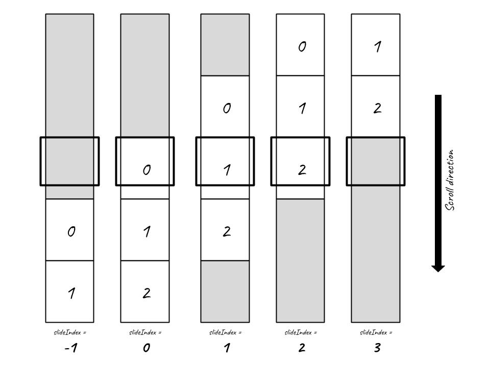
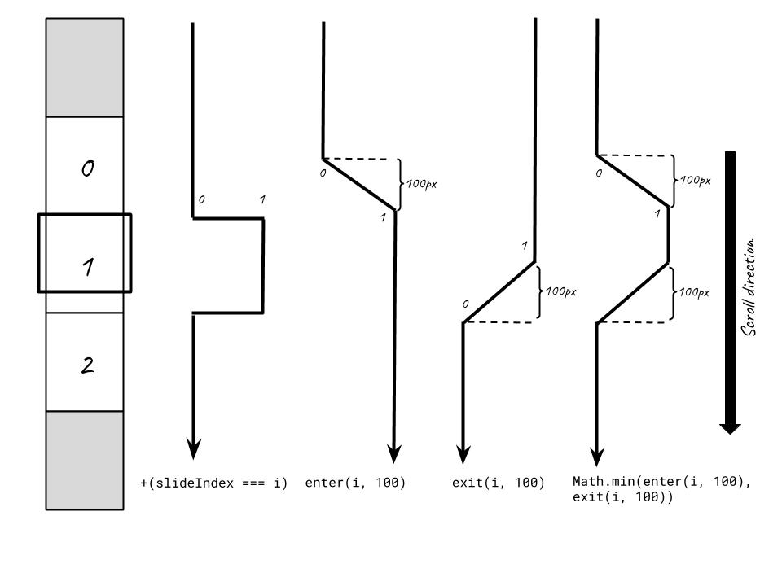

# Guide

## Sticky background

The `<st-scrolly>` component fundamentally act as a content distributor to layout different parts of your scrolly. It does this through the use of [slots](https://vuejs.org/v2/guide/components-slots.html) thus allowing users to flexibly include any content they want. We will start with a simple example consisting of just one sticky background.

<div style="text-align: center; margin-top: 1rem;">
  <iphone-mockup style="height: 40vh;" src="/demos/sticky" />
  <macbook-mockup style="height: 40vh;" src="/demos/sticky" />
</div>

```vue{4,23}
<template>
  <st-scrolly class="demo-sticky">
    <!-- sticky items should be placed in the background slot-->
    <template v-slot:background>
      <div class="centered">This is a sticky background</div>
    </template>
  </st-scrolly>
</template>

<script>
import '@st-graphics/scrolly/dist/bundle.css'
import StScrolly from '@st-graphics/scrolly'

export default {
  components: {StScrolly}
}
</script>

<style lang="scss">
.demo-sticky {
  // control sticky distance by setting slide height
  .slide {
    height: 800px;
  }
}
</style>
```

::: tip
Place sticky background content in the `background`-named slot. You can place multiple elements as long you wrap everything within a `<template v-slot:background>` tag
:::

::: tip
The scroll **distance** over which background content stays sticky is specified by adding a `height` CSS property on the `.slide` class. You might wonder where does the `.slide` class come in. This will be explained further in later parts.
:::

## Basic structure

The following is more complete example showing the use of the different slots.

### Using `background`, `foreground` & `default` slots

<div style="text-align: center; margin-top: 1rem;">
  <iphone-mockup style="height: 40vh;" src="/demos/slots" />
  <macbook-mockup style="height: 40vh;" src="/demos/slots" />
</div>

```vue{4,9,22}
<template>
  <st-scrolly class="demo-slots">
    <!-- this is sticky -->
    <template v-slot:background>
      <div class="centered">This is a sticky background</div>
    </template>

    <!-- scrollable static content here -->
    <template v-slot:default>
      <div class="slide">
        <div class="card">Slide 1</div>
      </div>
      <div class="slide">
        <div class="card">Slide 2</div>
      </div>
      <div class="slide">
        <div class="card">Slide 3</div>
      </div>
    </template>

    <!-- this is also sticky -->
    <template v-slot:foreground>
      <div class="centered">This is a sticky foreground</div>
    </template>
  </st-scrolly>
</template>

<script>
import '@st-graphics/scrolly/dist/bundle.css'
import StScrolly from '@st-graphics/scrolly'

export default {
  components: {StScrolly}
}
</script>
```

Sometimes, we want our sticky content to be in the foreground. The only change needed is putting them in the `foreground`-named slot instead. In between foreground and background is our **slides** content. Slides are **static** positioned containers that follow the normal flow of your document. Contrasted their sticky couterparts, they behaves like any other "scrollable" parts of your document.

::: tip
Anything that is not wrapped in a `<template v-slot:background>` or `<template v-slot:foreground>` tag goes into the default slot and becomes **slide** elements. The `<template v-slot:default>` wrapper in the example above is optional but recommended for better code organization.
:::

::: warning Rules of Slide
1. `<div>` tags should be used for **slide** elements as we require **slide** to be block elements.
2. There should be no gap (`margin-top` or `margin-bottom`) between adjacent **slide** elements.
3. The `.slide` class is optional, you can use any CSS selector to set a fixed height on the slide. Alternative is to have slide height implicitly set by the slide content.
:::

::: danger
4. **`vh` should never for slide height.** Always use a static value (eg. 800px) for height or let it be implicit by slide content. We will talk a bit more on this later.
:::

::: tip
When no default slot content is provided (as in the [Sticky background](#sticky-background) example), the fallback content will be an empty **slide** container: `<div class="slide"></div>`. By setting `height` property of this empty container, user can control the sticky scroll distance.
:::

## Dynamic content

The most important feature of any scrolly is having view state tied to scroll position. Among scrolly libraries, there have generally been two approaches:

1. Imperatively specify the position at which a scene change should be triggered (eg. [ScrollMagic](https://scrollmagic.io/))
2. The "declarative" way. Let specific elements' position relative to viewport determine when to trigger view state change (eg. [Scrollama](https://github.com/russellgoldenberg/scrollama)). For example you may want initiate an animation when a block of paragraph scroll into view. 

The 2nd approach is more developer-friendly as it automatically handles the reflow of content at different screen size and taps on newer browser capabilities like [Intersection Observer API](https://developer.mozilla.org/en-US/docs/Web/API/Intersection_Observer_API). This is the approach we have taken.

Under the Vue framework, we are able to bring the declarative approach further. Most scrolly libraries use an API similar to Intersection Observer where you register callbacks that is executed when scroll reaches certain positions. Our approach on the other hand exposes a **reactive variable** that represents the current scroll state which Vue can use declarative;y in its render function. This variable is called `slideIndex`.

### Using `slideIndex` from slot scope

`slideIndex` is exposed through slot scope. It is an **integer** value that changes based on the current slide in the viewport. Conceptually, "slide" is analagous to "scene" in ScrollMagic, "step" in Scrollama and "target element" in Intersection Observer. 

<div style="text-align: center; margin-top: 1rem;">
  <iphone-mockup style="height: 40vh;" src="/demos/slide-index" />
  <macbook-mockup style="height: 40vh;" src="/demos/slide-index" />
</div>

```vue{3-4}
<template>
  <st-scrolly class="demo-slide-index">
    <template v-slot:background="{slideIndex}">
      <div :style="getBgStyle(slideIndex)">
        <div class="centered">This is a sticky background</div>
      </div>
    </template>

    <div class="slide" v-for="(slide, i) in slides" :key="i">
      <div class="card">{{slide.text}}</div>
    </div>
  </st-scrolly>
</template>

<script>
import '@st-graphics/scrolly/dist/bundle.css'
import StScrolly, {clamp} from '@st-graphics/scrolly'

export default {
  components: {StScrolly},
  data () {
    return {
      slides: [
        {text: 'Slide 1', bgStyle: {backgroundColor: 'red'}},
        {text: 'Slide 2', bgStyle: {backgroundColor: 'green'}},
        {text: 'Slide 3', bgStyle: {backgroundColor: 'blue'}}
      ]
    }
  },
  methods: {
    getBgStyle (slideIndex) {
      const {slides} = this
      // clamp slideIndex to [0, n - 1]
      const clampedIndex = clamp(slideIndex, 0, slides.length - 1)
      return slides[clampedIndex].bgStyle
    }
  }
}
</script>

<style lang="scss">
.demo-slide-index {
  // control trigger points by setting slide height
  .slide {
    height: 800px;
  }
}
</style>
```

::: tip
In the example above, we have 3 slides populated using v-for directives. `slideIndex` which is exposed through the `background` slot scope `<template v-slot:background="{slideIndex}">` can take 5 states: -1, 0, 1, 2 & 3. Background style can be assigned declaratively by referencing the `slideIndex` variable.
:::

::: warning About slideIndex
The number of states `slideIndex` can take is always 2 more than the number of slides (N + 2). This is because we need to account for the state **before** the first slide enter and the state **after** the last slide exit. Sometimes a scrolly may occupies the entire length of the page. More often the scrolly is somewhere in the middle with there might be static content before and after the scrolly.

- Prior to first slide scrolling into view, `slideIndex` will be -1
- Upon first slide, `slideIndex` will become 0
- Everytime a new slide scroll into view, `slideIndex` will increment +1
- By the time we reach the last slide, `slideIndex` will be N - 1
- After the last slide scroll out, `slideIndex` will be N
- Between 0 and N - 1, scrolly is considered **active**. Contents inside `background` and `foreground` slots will be sticky


:::

::: tip
Often user might prefer to work with a **clamped** version of `slideIndex`. As shown in the example above, background style is only defined for `slideIndex` between 0 to 2. When `slideIndex` is outside of this range, we want to just use the nearest index. A convenient helper function `clamp` is provided this purpose. To use it:

```javascript
import StScroly, {clamp} from '@st-graphics/scrolly'

const clampedIndex = clamp(slideIndex, min, max)
```

If you need to use it inline within the template, add it to the component options `methods` field:

```vue
<template>
  <st-scrolly>
    <template v-slot:background="{slideIndex, slideCount}">
      <!-- clamp can be used directly in template -->
      <div>Slide {{clamp(slideIndex, 0, slideCount - 1) + 1}}</div>
    </template>
  </st-scrolly>
</template>

<script>
import StScroly, {clamp} from '@st-graphics/scrolly'

export default {
  methods: {clamp}
}
</script>
```
:::

::: tip
`slideIndex` is not only exposed through the `background` slot scope. You can access it on the `foreground` and `default` slot scope also (eg. `<template v-slot:background="{slideIndex}">`, `<template v-slot:default="{slideIndex}">`). Any slot content can be made dynamic through the reactive `slideIndex` variable. Besides `slideIndex`, other useful variables are also exposed on the slot scope. Refer to [API](/api/#slot-scope) for the full list.
:::

## Adjust trigger points

Intersection Observer API provides a `rootMargin` to fine-tune when a trigger should be fired. Sometimes, user may want the state transition to happen **before** the target element enters viewport. Our library has a similar concept called `triggerOffset`. It is one of the `props` you can set on the scrolly component `<st-scrolly :trigger-offset="customTriggerOffset">`. By default, `slideIndex` increment when the **top** of the slide is align with the **top** of the window. With `triggerOffset` you can **offset** this "trigger point".

### Using `triggerOffset` props

<div style="text-align: center; margin-top: 1rem;">
  <iphone-mockup style="height: 40vh;" src="/demos/trigger-offset" />
  <macbook-mockup style="height: 40vh;" src="/demos/trigger-offset" />
</div>

```vue{2}
<template>
  <st-scrolly class="demo-trigger-offset" :trigger-offset="triggerOffset">
    <div class="slide" v-for="(slide, i) in slides" :key="i" :style="slide.bgStyle"></div>

    <template v-slot:foreground="{slideIndex}">
      <div class="centered">
        <div class="card">{{getText(slideIndex)}}</div>
        <label>
          Offset =
          <input type="number" min="-200" max="100" v-model.number="triggerOffset" step="100">
        </label>
      </div>
    </template>
  </st-scrolly>
</template>

<script>
import '@st-graphics/scrolly/dist/bundle.css'
import StScrolly, {clamp} from '@st-graphics/scrolly'

export default {
  components: {StScrolly},
  data () {
    return {
      triggerOffset: -200,
      slides: [
        {text: 'Slide 1', bgStyle: {backgroundColor: 'red'}},
        {text: 'Slide 2', bgStyle: {backgroundColor: 'green'}},
        {text: 'Slide 3', bgStyle: {backgroundColor: 'blue'}}
      ]
    }
  },
  methods: {
    getText (slideIndex) {
      const {slides} = this
      // clamp slideIndex to [0, n - 1]
      const clampedIndex = clamp(slideIndex, 0, slides.length - 1)
      return slides[clampedIndex].text
    }
  }
}
</script>
```

::: warning About triggerOffset
Negative `triggerOffset` will make slide transition happens **earlier** (i.e. before the top of the slide reach the top of the window) while positive `triggerOffset` will **delay** slide transition (i.e. after top of the slide has scroll past the top of the window). 


:::

## Position the sticky window

By default, the sticky `background` and `foreground` containers take up the full length of the viewport. This can be modified using the props `windowTop` and `windowHeight`.

### Using `windowHeight` & `windowTop` props

<div style="text-align: center; margin-top: 1rem;">
  <iphone-mockup style="height: 40vh;" src="/demos/window" />
  <macbook-mockup style="height: 40vh;" src="/demos/window" />
</div>

```vue{2}
<template>
  <st-scrolly class="demo-window" :window-height="60 * vh" :window-top="20 * vh">
    <template v-slot:background>
      <div class="centered">This is a sticky background</div>
    </template>
  </st-scrolly>
</template>

<script>
import '@st-graphics/scrolly/dist/bundle.css'
import StScrolly from '@st-graphics/scrolly'

export default {
  components: {StScrolly},
  data () {
    return {
      vh: window.innerHeight / 100
    }
  }
}
</script>
```

## Smooth transition

Mike Bostock (creator [D3](https://d3js.org/)) explained in the article [How To Scroll](https://bost.ocks.org/mike/scroll/) that transition between scenes can be time-based (instantaneous trigger) or position-based. With time-based transition once a scroll threshold is reached, scene transition is triggered immediately and runs over a fixed time duration. Position-based transition on the other hand runs over a scroll distance. `slideIndex` can be seen as a form of trigger for time-based transition. To use position-based trigger, we provide two other **reactive variables** `enter` & `exit`. As with `slideIndex`, they are exposed through slot scopes.

### Using `enter` & `exit` from slot scope

<div style="text-align: center; margin-top: 1rem;">
  <iphone-mockup style="height: 40vh;" src="/demos/enter-exit" />
  <macbook-mockup style="height: 40vh;" src="/demos/enter-exit" />
</div>

```vue{3-4,33}
<template>
  <st-scrolly class="demo-enter-exit">
    <template v-slot:background="{enter, exit}">
      <div v-for="(slide, i) in slides" :key="i" :style="getBgStyle(i, enter, exit)">
        <div class="centered">This is a sticky background</div>
      </div>
    </template>

    <div class="slide" v-for="(slide, i) in slides" :key="i">
      <div class="card">{{slide.text}}</div>
    </div>
  </st-scrolly>
</template>

<script>
import '@st-graphics/scrolly/dist/bundle.css'
import StScrolly, {clamp} from '@st-graphics/scrolly'

export default {
  components: {StScrolly},
  data () {
    return {
      slides: [
        {text: 'Slide 1', bgStyle: {backgroundColor: 'red'}},
        {text: 'Slide 2', bgStyle: {backgroundColor: 'green'}},
        {text: 'Slide 3', bgStyle: {backgroundColor: 'blue'}}
      ]
    }
  },
  methods: {
    getBgStyle (index, enter, exit) {
      const {slides} = this
      const opacity = Math.min(enter(index, 400), exit(index, 400))
      return {
        ...slides[index].bgStyle,
        opacity
      }
    }
  }
}
</script>

<style lang="scss">
.demo-enter-exit {
  // stack background layers on top of each other
  .background > div {
    position: absolute;
    left: 0;
    top: 0;
    right: 0;
    bottom: 0;
    opacity: 0;
    mix-blend-mode: overlay;
  }
}
</style>
```

::: warning About enter & exit
Unlike `slideIndex` which is an **integer**, `enter` & `exit` is a pair of **function** which can be used together or individually to implement smooth transition. The functions have the following signature:

```ts
type t = number // t ∈ [0, 1]
declare function enter (index: number, distance?: number, offset?: number): t
declare function exit (index: number, distance?: number, offset?: number): t
```

User will pass in slide index *i* and transition distance *d* as parameters. The functions will return a number *t* between 0 to 1.

- When the indexed *i* slide starts entering, *t* will be 0
- As the slide enters, *t* gradually **increases** to 1
- When the slide completes enter, *t* will be 1
- When the indexed *i* slide starts exiting, *t* will be 1
- As the slide exits, *t* gradually **decreases** to 0
- When the slide completes enter, *t* will be 0
- The length over which *t* transit from 0 > 1 & 1 > 0 is controlled by the *d* parameter.


:::

::: tip
Why does `enter`/`exit` output a number between 0 and 1? *t* ∈ [0, 1] is what we call an interpolation parameter. By passing it into an [interpolator function](https://github.com/d3/d3-interpolate), you can interpolate between any two values. Say you want to interpolate between two numeric values A & B. You can use the linear interpolator `t => (1 - t) * A + t * B`. More complex interpolators allow you to interpolate non-numeric data types. You can even implement easing by applying one of the Robert Penner's [easing functions](https://github.com/d3/d3-ease) before passing *t* into the interpolator. In simple cases such as the CSS property `opacity`, *t* can be used directly.

To apply **both** `enter` and `exit`, use the expression `Math.min(enter(i, d), exit(i, d))`
:::

::: danger
**`slideIndex` should never be used together with `enter`/`exit` in the same expression.** `enter(slideIndex, d)` is an anti-pattern will lead to unexpected outcome. Always use a fixed slide index for each `enter`/`exit` call.
:::